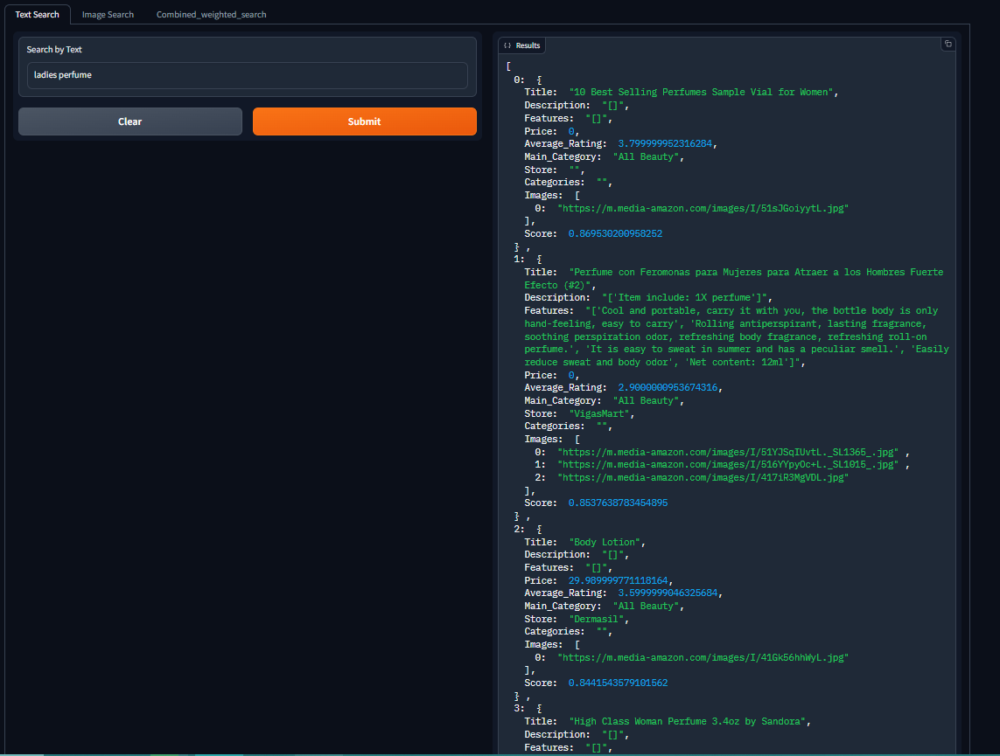
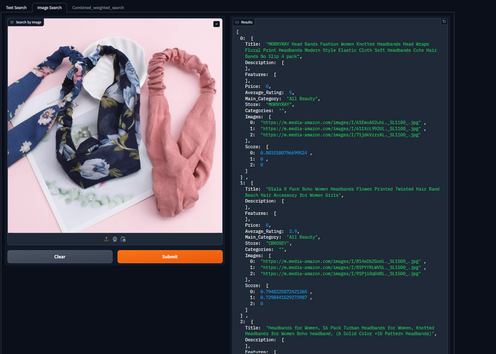

# Milvus-Based Gradio Application

This is a Gradio application that leverages Milvus for semantic search. The embeddings have been generated using [Clip-retrieval](https://github.com/rom1504/clip-retrieval). The model used for generation of embeddings is [Open Clip](https://github.com/mlfoundations/open_clip) The app requires a Milvus database with specific collections and uses a Python module for query embeddings generation. Below are the instructions to get the application up and running.

## Demo Images



## Prerequisites

- Docker Compose
- Python 3.11
- Milvus installed via Docker
- Required Python packages: `pymilvus`, `gradio`, `all_clip`

## Installation

1. **Clone the Repository**

   ```bash
   git clone https://github.com/awaisnazir08/Semantic-Search-using-Vector-Database.git
   cd Semantic-Search-using-Vector-Database
   ```

2. **Install Python Packages**

    ```bash
    pip install pymilvus gradio all_clip
    ```

3. **Run Milvus Docker Container**

You need to have Docker installed on your local machine. To run Milvus in a Docker container, execute the following command:

```bash
    docker compose -f milvus-standalone-docker-compose.yml up -d
```
Ensure that Milvus is running on port `19530`. You may need to specify this port and the `IP` of your device in the `semantic_search_app.py` file.

## Database Setup

Your application requires a Milvus database named `Products` with two collections:

- **images**
- **products**

If these collections are not present in the Milvus database, the application will encounter errors.

You can create the necessary database and collections via Milvus's CLI or Python SDK.

#### Configure Connection

In the `semantic_search_app.py` file, specify the IP address of your device and port `19530`:

```python
HOST = 'your-device-ip'
PORT = '19530'
```

## Run the Application

The code is structured as a Python module. You can run the app using:

```bash
python -m App.semantic_search_app
```

### Cloud Setup

Alternatively, you can run the Milvus Docker container on a cloud instance. Update the `semantic_search_app.py` with the appropriate host and port of the cloud instance:

```python
HOST = 'cloud-instance-ip'
PORT = '19530'
```

Then, run the application as described in the local setup.

